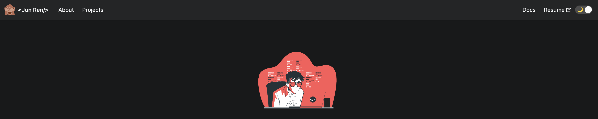

# 🚀 Hi there!

---

Welcome to my personal portfolio website! I also use this as a store of my zettelkasten

## 🐼 Components

> [!TIP]
> Brief overview of components

| Component          | Description                                          |
| ------------------ | ---------------------------------------------------- |
| `website`          | [Core of my portfolio](https://chanjunren.github.io) |
| `website` > `docs` | Old notes (To be migrated to Zettelkasten)           |
| `vault`            | Zettelkasten / notes store                           |

## 🥸 References

- [Zettelkasten](https://www.youtube.com/watch?v=E6ySG7xYgjY&t)
- https://www.markdownguide.org/cheat-sheet/
- https://docusaurus.io/docs/static-assets
  - https://docusaurus.io/docs/markdown-features/admonitions
