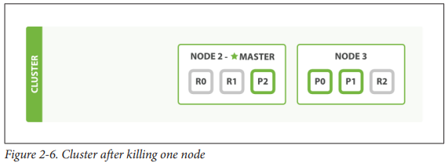

# Life inside a cluster

## Terminology

| Term          | Description                                                                                   |
|---------------|-----------------------------------------------------------------------------------------------|
| Node          | Running instance of EES                                                                       |
| Cluster       | >= 1 node                                                                                     |
| Master node   | Single elected node in the cluster responsible for cluster wide changes (+/- index, +/- node) |
| Shard         | <ul><li>Containers of data (stores documents)</li><li>Allocated to node</li></ul>             |
| Primary Shard | Document store                                                                                |
| Replica Shard | Replica of primary shard                                                                      |
 

## Adding failover
- Avoid single point of failure by running multiple nodes

## Horizontal scaling

- Adding one node

- Increasing numebr of replicas

## Coping with failure
:::warning Scenario: One node killed

:::

- Actions:
	- One node promtoed to master (node 2)
	- Replica shards promoted to primary shard
	- Health check yellow (insufficient replicas)

