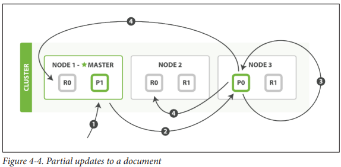
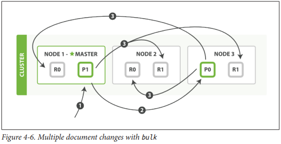

# Distributed Document Store
:::warning
Internal details, just reading for fun
:::

## Routing a Document to a Shard
- Formula for determining which shard a document belong to:
```
shard = hash(routing) % number_of_primary_shards
```
- Routing value is an arbitrary string (defaults to document's _id)

- Discussion of routing value done in later chapter, but basically it's better to customise this value

:::warning
This explains why the number of primary shards can be set only when an index is
created and never changed: if the number of primary shards ever changed in the
future, all previous routing values would be invalid and documents would never be
found.


But, there are other strategies to scale an index (chapter 43)
:::

### How Primary and Replica Shards interact
- Copies of the same shard are never allocated to the same node
- Every node is fully capable of serving any request
	- Every node knows the location of every document in the cluster and can forward requests directly to required nodes
- Good practice to round-robin through all nodes to spread the load

## Creating, Indexing and Deleting a Document
- 

1. Client sends req to node 1
2. Node uses _id to determine owner shard => forward to node that was allocated primary shard
3. Executes request on primary shard => success ? forward req to replica shards on node 1 / 2
4. Node 3 reports success to requesting node

:::info
By the time client receives successful resposne, all documents have been executed on primary and replica shards
:::

### Available options
- `replication`
	- default value: `sync`
- `consistency`
	- primary shard requires a `quorum` 
	-  number of active shards before attempting write operation
	- e.g.
	```
	int( (primary + number_of_replicas) / 2 ) + 1
	```
- `timeout`
	- For handling scenarios where there are insufficient shard copies
	- Duration that ES will wait for before throwing error (while praying that more shards appear)

## Retrieving a Document
- Document can be retrieved from primary / replica shard

- For read rqeuests, the requesting node will choose a different shard copy on every request to for load balancing (round-robin)

- It is possible that a document is not available on replica shard but on primary shard => might receive error that document doesn't exist

## Partial Updates

1. Client sends update request to `Node 1`
2. Forwards request to `Node 3` (where primary shard is allocated)
3. Retrieve-change-index, retries up to `retry_on_conflict` times before giving up
4. If successful, forwards new version of the document in parallel to replica shards, reports success to rqeuesting node => reports success to client


:::note
Document-Based Replication is used 

i.e. instead of just forwarding the change, the entire updated document is forwarded

Ensures that changs arrive in the same order they were sent
:::

## Multidocument Patterns
- Similar pattern to single operation
- Difference: Requesting node knows which shard each document lives 
- Steps:
1. Breaks up multidocument rqeuest into multidocument request per shard 
2. Forwards these in parallel to each participating node
3. Collates their responses into a single response
4. Return to client 


## Funny format design
:::info
Why funny format rather than JSON using a JSON array?

TLDR: Memory efficiency
:::
- JSON Array implementation
	1. Parse JSON into an array (including document data)
	2. Determine which shard a request should go to
	3. Create array of requests for each shard
	4. Serialize arrays into internal transport format
	5. Send requests to each shard

- Disadvantage:
	- A lot of RAM to hold copies of same data, but create many more data structures that JVM would have to garbage collect
- Implementation:
	 - Data is read directly, and just parses the `action` / `metadata` to determine which shard to handle each request
- Advantage:
	- No redundant copying of data / wasted data structures