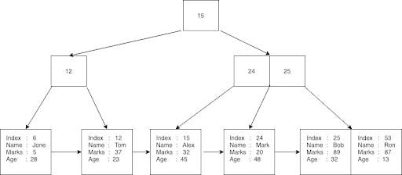
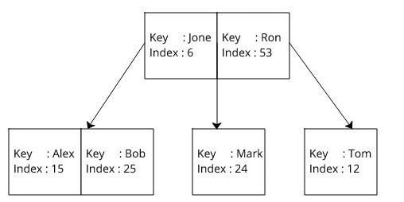
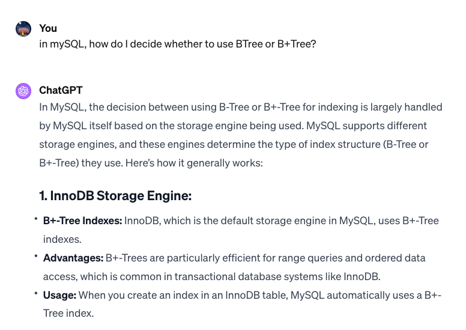

# Index Implementation

:::note
Adapted from https://builtin.com/data-science/B Tree-index
:::

## B Tree
- A balanced tree data structure for maintaining sorted data
- Nodes contain keys and data (or references to data)
- Child pointers in nodes are positioned between keys

### Why is it necessary
- Facilitates CRUD operations in logarithmic time due to balanced structure

## B+ Tree
- Similar to B Tree but stores data only in leaf nodes
- Internal nodes store keys for navigation
- Leaf nodes are linked together, containing all data

### How is it used
:::note Data to store

| Name | Mark | Age |
|------|------|-----|
| June | 5    | 28  |
| Alex | 32   | 45  |
| Tom  | 37   | 23  |
| Ron  | 87   | 13  |
| Mark | 20   | 48  |
| Bob  | 89   | 32  |

:::

#### Storing table
- Uses B+ Tree for primary key indexing
- Rows are serialized and stored in B+ Tree leaf nodes

:::note BTree+ generated for PKEY

:::

#### Iterating through table
- Uses binary search and sequential access in B+ Tree

#### Using the index
:::note BTree generated for index

:::

| DS      | Use Case                                                                      |
|---------|-------------------------------------------------------------------------------|
| B Tree  | Often used for indexes where quick search, insertion, and deletion are needed |
| B+ Tree | Preferred for indexing large data sets, particularly for range queries        |

## Comparisons
|                                        | B Tree                                                                                                                               | B+ Tree                                                               |
|----------------------------------------|--------------------------------------------------------------------------------------------------------------------------------------|-----------------------------------------------------------------------|
| Node utilization / Disk I/O Efficiency | Each node holds keys and data (or pointers to data) => **limits number of keys each node can hold** => deeper tree / more disk reads | Internal nodes only store keys => shallower tree => fewer disk reads  |
| Range Queries / Sequential Access      | Range queries might require traversal back up anddown to the tree => less efficient                                                  | Leaf nodes linked => more efficient range queries / sequential access |
| Key Duplication                        | No duplicate keys between internal node (key / associated data only stored once)                                                     | Keys stored in both leaf / internal nodes                             |

## Conslusion
> **Efficiency in Different Scenarios**: While both B Trees and B+ Trees are efficient, B+ Trees are generally preferred in disk-based systems because they provide better disk I/O efficiency and are more effective for range queries and sequential access

> **Logarithmic Time Complexity**: Both structures indeed offer logarithmic time complexity for basic operations, but the constants involved (like the number of disk reads) can be significantly different, affecting real-world performance

> **Space Efficiency**: If B Trees are only storing pointers (not the actual data), the difference in space efficiency becomes less pronounced. However, B+ Trees still often have an edge due to their structure allowing for more keys per node and thus a shallower tree

