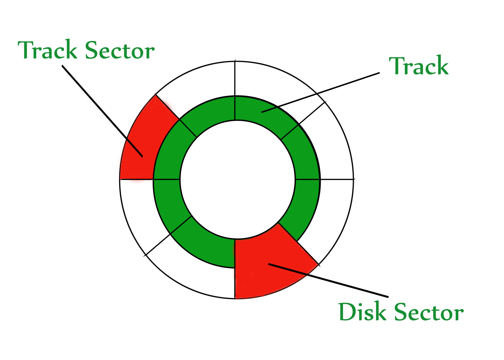

# Indexing

## Disk Structure
### Logical Structure
- Disk is divided into concentric tracks
- Each track is divided into sectors

:::info

_Image of the structure of a disk from GeekforGeeks_
:::

### Block
- Intersection of track & sector
- Identified usign `(track_num, section_num)`
    - typically 512 bytes
### Read / Write operations
- Performed in terms of blocks

### Offset
- Number of bytes from the start of a block
- Used to identify a specific byte within a block
