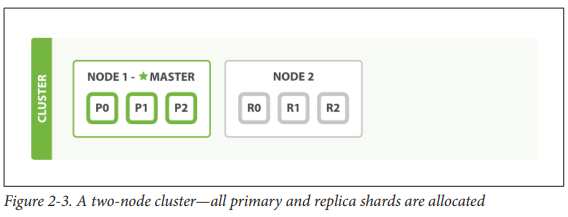
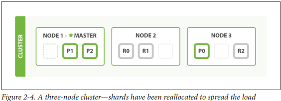
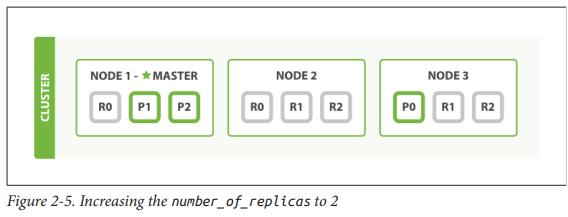

# Life inside a cluster

## Terminology
- Node: Running instance of elasticsearch
- Cluster: >= 1 node
- Master node: A single elected node in the cluster, responsible for cluster wide changes (creating / deleting index, adding / removing node)
- Index: Logical namespace that points to one or more physical shards 
-Shard: Containers of data (stores documents), shards are allocated to node
- Primary shard: Document store
- Replica shard: Replica of primary shard
- 

## Adding failover
- Avoid single point of failure by running multiple nodes

## Horizontal scaling

- Adding one node

- Increasing numebr of replicas

## Coping with failure
- Scenario: One node killed

- Actions:
	- One node promtoed to master (node 2)
	- Replica shards promoted to primary shard
	- Health check yellow (insufficient replicas)

