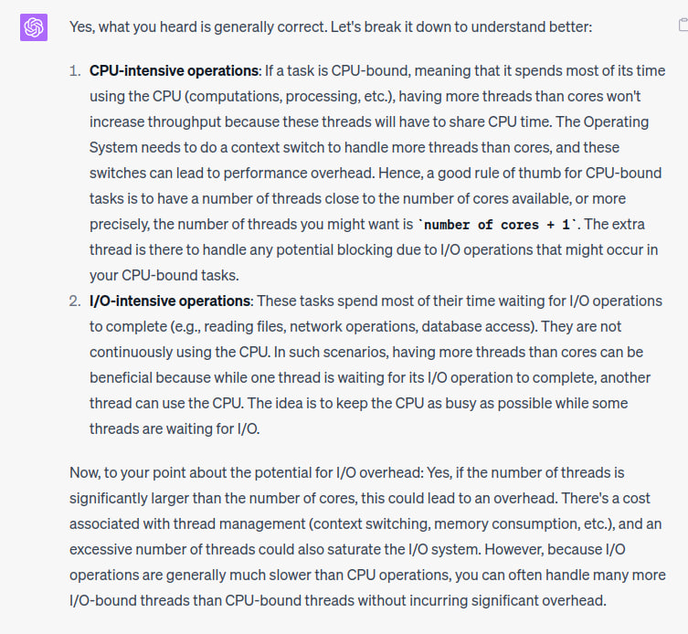
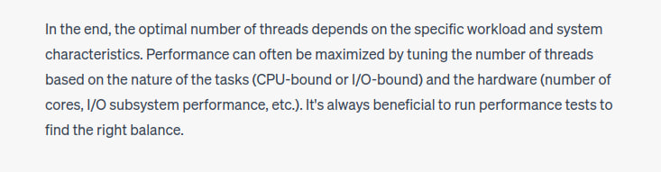

# ExecutorService

## Youtube
- Threadpool that has fixed number of threads
- Blocking queue to store the list of tasks
  - Considerations
    - Concurrency (multiple threads will add / remove tasks from this queue)
    - Size (number of threads in threadpool to core size)
    - Types of tasks
      - CPU intensive tasks
      - IO intensivity 
       

## Resources
- [Youtube](https://youtu.be/6Oo-9Can3H8)
- https://docs.oracle.com/javase/8/docs/api/java/util/concurrent/ExecutorService.html