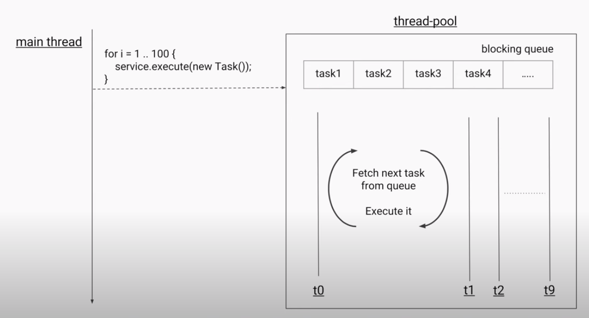
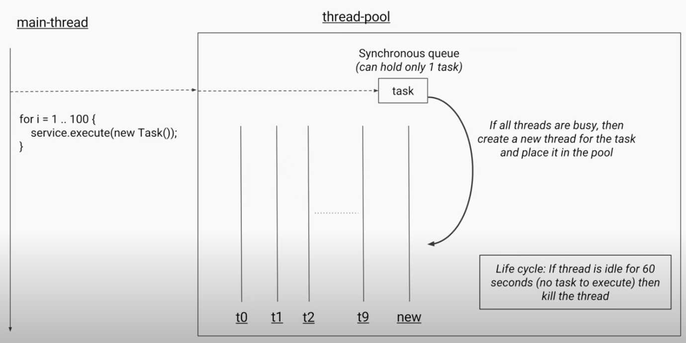
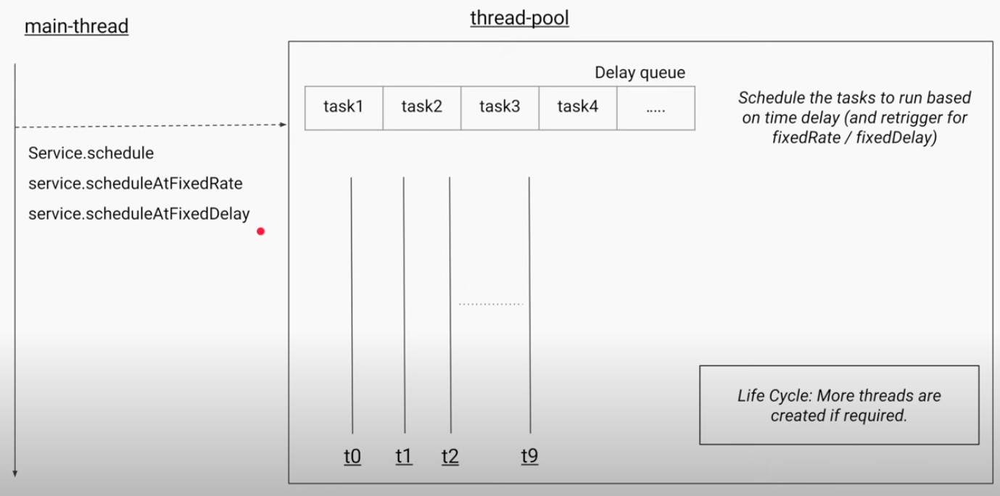
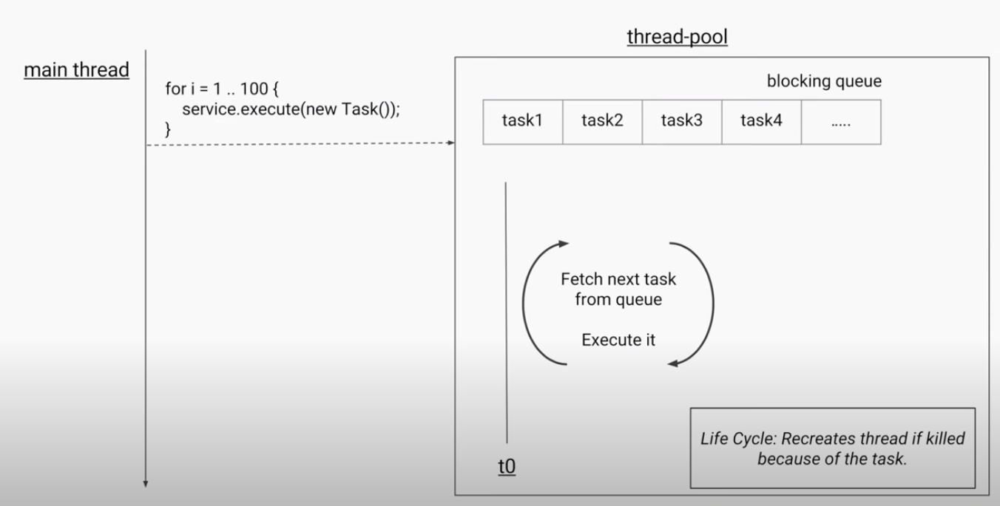

# Pool Types

## Fixed ThreadPool

## Cached ThreadPool

## Scheduled Threadpool

## Single Threaded Executor

## Resources
- [Youtube](https://www.youtube.com/watch?v=sIkG0X4fqs4)
- https://docs.oracle.com/javase/8/docs/api/java/util/concurrent/ExecutorService.html