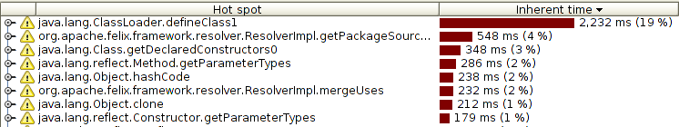
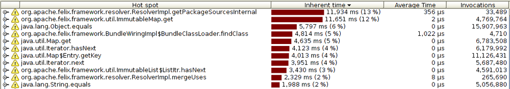
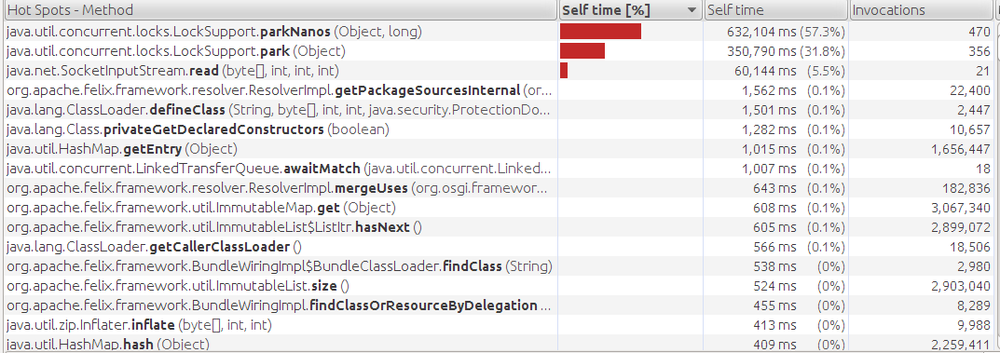
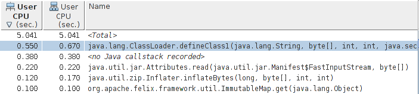

# Java Monitoring Tools
| Tool from JDK | Scope |
| ------------ | ------ |
| jcmd | Basic class, thread, VM information for a java Process | 
| jconsole | Graphical view of JVM activities (thread, class, GC) |
| jhat | Reads and analyze memory heap dumps => postprocessing utility ( after application finishes)|
| jmap | Heap dumps and other information about JVM memory usage |  
| jinfo | View / set (dynamically) system proprties of JVM | 
| jstack | Dumps stacks of Java Process |
| jvisualvm | GUI tool to monitor JVM, profile running application, analyze heap dumps (can be live / postprocessing) |


## Basic VM Information
### Uptime
_length of time JVM has been up_
```
% jcmd process_id VM.uptime
```
### System Proprties
```
jcmd process_id VM.system_properties

// or 

jinfo -sysprops process_id

```
### JVM Tuning Flags
```
jcmd procses_id VM.flags [-all]

// Viewing flags on a platform
% java other_options -XX:+PrintFlagsFinal -version
...Hundreds of lines of output, including...
uintx InitialHeapSize                          := 4169431040     {product}
intx InlineSmallCode                           = 2000 
```

:::note
Colon indicates that a non default value is being used
1. Flag's value specified directly on command line
2. Some other option indirectly changed that option
3. JVM calculated the default value ergonomically
:::

### Working with tuning flags
```
// Inspecting value of individual flag
% jinfo -flag PrintGCDetails process_id
-XX:+PrintGCDetails

// jinfo can change the value of any fdlag, but that doesn't mean JVM will respond to the change => based on which flags are marked manageable
% jinfo -flag -PrintGCDetails process_id  # turns off PrintGCDetails
% jinfo -flag PrintGCDetails process_id
-XX:-PrintGCDetails
```

### Thread information
:::note
Information can be displayed in real time => determine if certain threads are blocked
:::
```
// Obtaining stacks of a process 
% jstack process_id

% jcmd process_id Thread.print
```

## Profiling Tools
- Most important tool
- Work by attaching themselves to a Java application and exchanging information through a socket
    - Profiler must have sufficiently large heap
    - Run the profiling tool with a concurrent GC algorithm
    - Ill timed pauses can cause data overflow
- Occurs in 2 modes
    - _Sampling_: sth like taking snapshots
    - _Instrumented_

:::note
There are many different profiling tools so it makes sense to use different tools 

Different profilers might find different problems on the same application
:::

:::warning
Profiling will alter the performance characteristics

You must hence limit the impact of profiling to more closely model how application normally behaves
:::

:::info
Read the detailed analysis in the book for a better understanding, too much to summarise here
:::

### Sampling Profilers
- Most common kind of profiler
- Introduce fewer measurement artifacts because of relatively low profile
- Different sampling profiles behave differently
- Can be subject to all sorts of errors



### Instrumented Profilers
- Yield more information about an application
- Work by altering bytecode sequence of classes as they are loaded
    - Inserting code to count invocations etc.
- Much more likely to introduce performance differences => should be set up to instrument small sections of the code




### Blocking Methods and Thread Timelines
- Threads that are blocked may or may not be a source of performance issues => necessary to examine why they are blocked
- Blocked threads can be identified by the method that is blocking / timeline analysis of the thread



### Native Profilers
- Provide visiblity into both JVM / application code
- If native profilers shows that time in GC dominates CPU usage => should tune collector
    - If significant time spent in compilation threads => application's performance not affected 




## Java Mission Control

